# 👋 Hi, I'm Mark

### Computer Engineering Student · Software · Embedded Systems · Networking · AI

  

  

---

## 👨‍💻 About Me

🎓 Computer Engineering student at **Politehnica University of Timișoara**

💻 Interested in both **software and hardware development**

⚙️ I enjoy building systems that combine **software, electronics and embedded hardware**

🌐 Interested in **Networking & Cybersecurity**, while continuously developing my knowledge in network technologies, infrastructure and security

🧠 Exploring **Artificial Intelligence, Machine Learning & Deep Learning** and continuously building my knowledge in these areas

🐧 Comfortable working with **Linux, Bash and command-line environments**

🚀 Always looking for new technologies, challenging projects and opportunities to learn

---

---

# 🌱 Currently Exploring

  

  

`Software` · `Embedded Systems` · `Networking` · `Cybersecurity` · `AI / ML`

---

# 🏅 Certifications

  

**CCNA: Introduction to Networks**  
Verified Cisco networking credential — click the badge to view it on Credly.

---

# 🌍 Languages

🇷🇴 **Romanian** — Native &nbsp;&nbsp;·&nbsp;&nbsp;
🇭🇺 **Hungarian** — Native &nbsp;&nbsp;·&nbsp;&nbsp;
🇬🇧 **English** — B2 &nbsp;&nbsp;·&nbsp;&nbsp;
🇩🇪 **German** — B1 / DSD I

---

# 🤝 Let's Connect

Interested in **software, embedded systems, networking, cybersecurity and AI**  
and always open to learning, building and collaborating.

  

  

### ⭐ Thanks for visiting!

